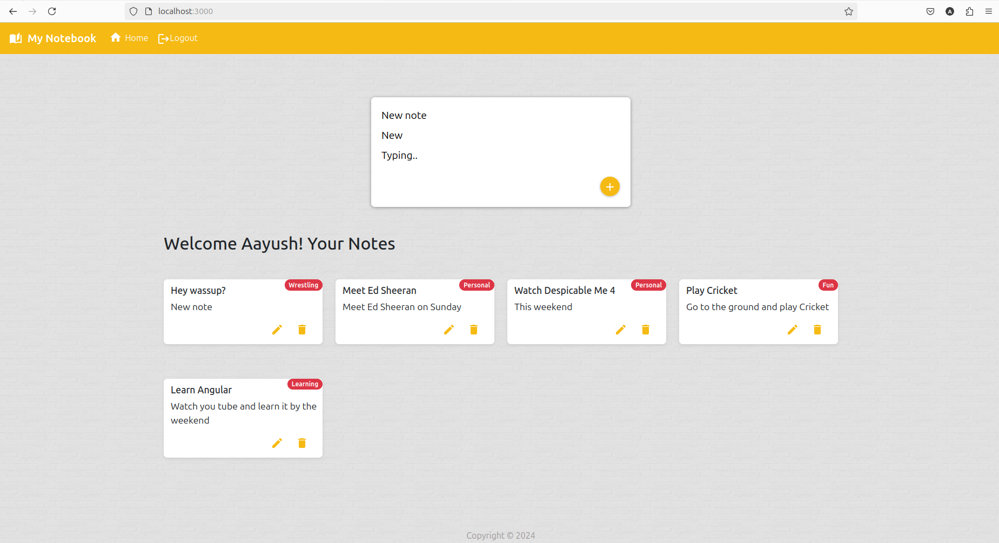
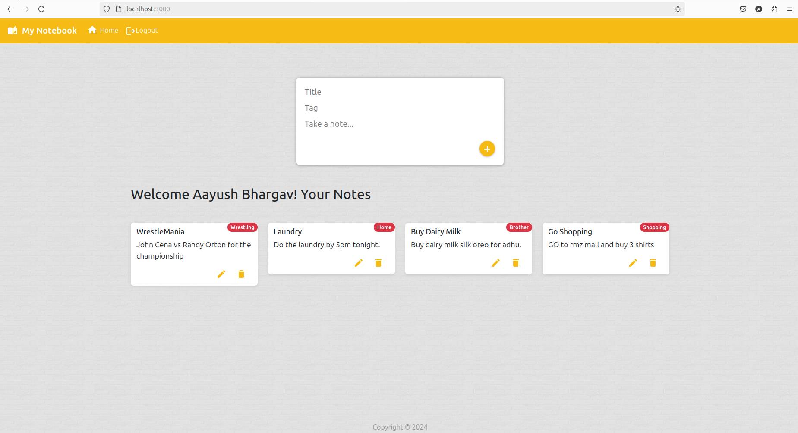

# My-Notebook
The Notes App is a full-featured MERN stack application designed for managing personal notes and to-dos. It provides a secure and interactive platform where users can log in, create, edit, and delete notes. This was my first full stack project!

## Screenshots

### Home Page

### Another User's Home Page

## Features

- **User Authentication**: Secure login system requiring users to provide a valid email and password. Authentication ensures that only authorized users can access and manage their notes.
- **Note Management**: Users can add, edit, and delete notes. The application supports full CRUD (Create, Read, Update, Delete) operations on notes.
- **Persistent Storage**: Notes are stored in MongoDB, ensuring that data is saved and accessible across sessions.
- **Responsive UI**: The application features a clean and responsive interface for managing notes efficiently.
- **Dynamic Note Display**: The app dynamically displays notes, allowing users to view all their notes or manage them as needed.

## How to Run
- Download all the files.
- Run 'cd my-notebook' and then 'npm install' and then 'npm run start' to start the frontend.
- Run 'cd my-notebook/backend' and then 'npm install' and then 'nodemon index.js' to get the server up and running.
- Make sure mongo DB is also installed in your computer.

## Technologies Used

- **MERN Stack**: Utilizes MongoDB, Express.js, React, and Node.js to provide a seamless and interactive user experience.
- **Node.js & Express**: The backend is built with Node.js and Express, providing APIs for user authentication and note management.
- **MongoDB**: Stores user data and notes persistently, ensuring data integrity and accessibility.
- **React**: Used for building the user interface, allowing for a responsive and dynamic front-end experience.

## How It Works

1. **User Authentication**: Users must log in with their email and password. The authentication process verifies credentials against the database to ensure secure access.
2. **Note Operations**: Once logged in, users can perform various operations on their notes, including adding new notes, editing existing ones, and deleting notes.
3. **Data Persistence**: All notes and user data are stored in MongoDB, ensuring that changes are saved and can be retrieved even after logging out and logging back in.
